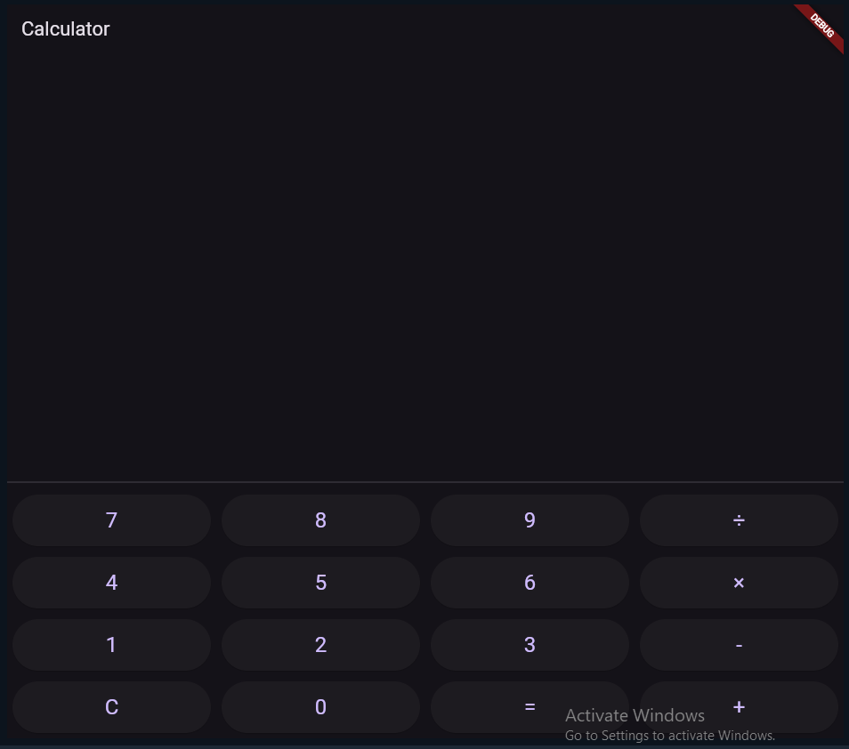
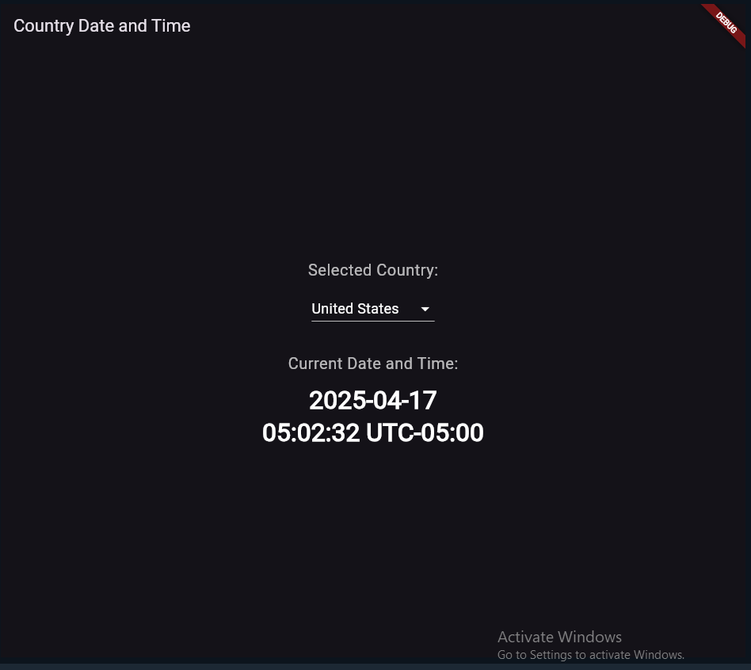

# 🧮 Simple Flutter Calculator App

A clean and minimal Flutter-based calculator app supporting basic arithmetic operations.

## 🔍 Preview

### 📱 Calculator UI

### 🕒 Region Time Feature (Optional/Upcoming)

---

## 🚀 Features

- Basic arithmetic: `+`, `-`, `×`, `÷`
- Clean UI using Flutter’s `MaterialApp`
- Responsive button layout
- Simple expression parsing

